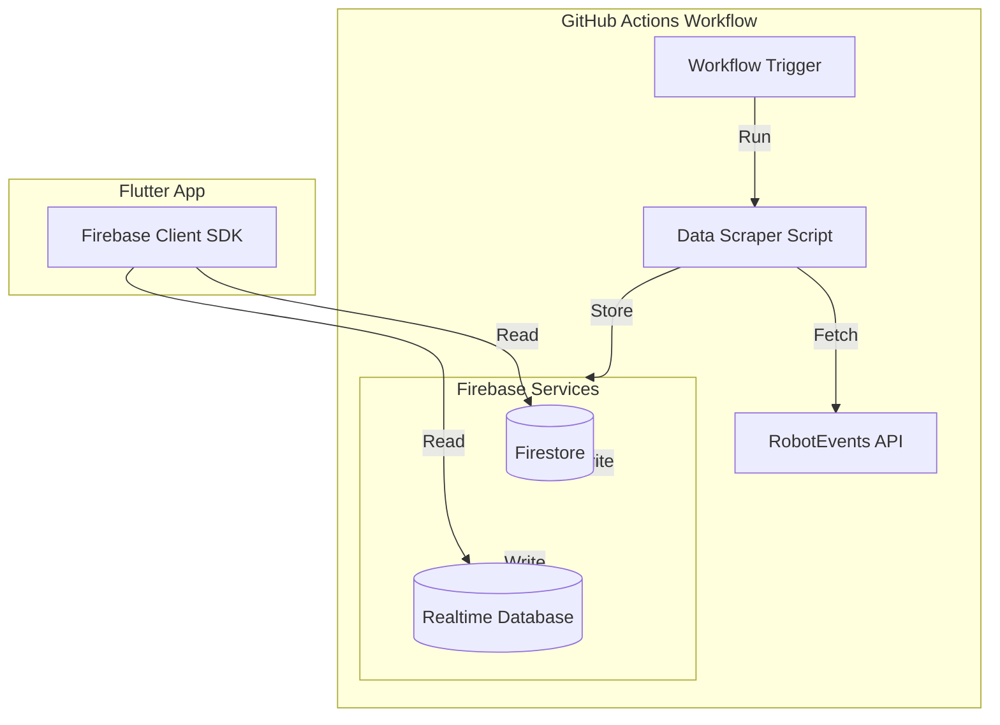

# RobotEvents Firebase Sync System

## Overview

Build a GitHub Actions workflow that performs a one-time comprehensive scrape of RobotEvents API data and stores it in Firebase (Firestore + Realtime Database). This will serve as a cache layer to replace direct API calls in the Flutter app.

## Architecture



## Project Structure

```
robotevents-firebase-sync/
├── .github/
│   └── workflows/
│       └── sync-robotevents.yml          # GitHub Actions workflow
├── scripts/
│   ├── sync.js                           # Main sync script (Node.js)
│   ├── config.js                        # Configuration and Firebase setup
│   ├── scrapers/
│   │   ├── events-scraper.js            # Scrape events
│   │   ├── event-details-scraper.js     # Scrape event details, divisions
│   │   ├── event-teams-scraper.js       # Scrape event teams
│   │   ├── event-matches-scraper.js     # Scrape event matches
│   │   ├── event-rankings-scraper.js    # Scrape regular rankings
│   │   ├── event-finalist-rankings-scraper.js  # Scrape finalist rankings
│   │   ├── event-skills-scraper.js      # Scrape skills results
│   │   └── season-events-scraper.js     # Scrape season events
│   └── utils/
│       ├── rate-limiter.js               # Rate limiting helper
│       ├── pagination.js                  # Pagination handler
│       └── firebase-helpers.js           # Firebase write helpers
├── package.json                          # Node.js dependencies
├── firebase.json                         # Firebase config
├── .firebaserc                           # Firebase project config
├── .env.example                          # Environment variables template
└── README.md                             # Documentation
```

## Implementation Plan

### 1. Project Setup

**Files to create:**

- `package.json` - Node.js project with dependencies:
    - `firebase-admin` - Firebase Admin SDK
    - `firebase` - Firebase client SDK (if needed)
    - `axios` or `node-fetch` - HTTP client
    - `dotenv` - Environment variable management

- `.env.example` - Template for environment variables:
    - `ROBOTEVENTS_API_KEYS` - Comma-separated API keys
    - `FIREBASE_PROJECT_ID` - Firebase project ID
    - `FIREBASE_PRIVATE_KEY` - Firebase service account private key
    - `FIREBASE_CLIENT_EMAIL` - Firebase service account email
    - `TARGET_SEASON_ID` - Season ID to scrape (e.g., 196 for VEX IQ 2025-2026)

### 2. Firebase Configuration

**Firestore Collections Structure:**

```
/events/{eventId}
 - event data (id, sku, name, start, end, season, program, location, divisions, level, etc.)
 - lastUpdated: timestamp

/events/{eventId}/divisions/{divisionId}
 - division data (id, name, order)
 - lastUpdated: timestamp

/events/{eventId}/divisions/{divisionId}/rankings/{rankingId}
 - ranking data (rank, team, wins, losses, ties, wp, ap, sp, etc.)
 - lastUpdated: timestamp

/events/{eventId}/divisions/{divisionId}/finalistRankings/{rankingId}
 - finalist ranking data
 - lastUpdated: timestamp

/events/{eventId}/divisions/{divisionId}/matches/{matchId}
 - match data (id, round, instance, matchnum, scheduled, started, scored, alliances, etc.)
 - lastUpdated: timestamp

/events/{eventId}/skills/{skillId}
 - skills data (id, team, type, rank, score, attempts)
 - lastUpdated: timestamp

/events/{eventId}/teams/{teamId}
 - team data (id, number, team_name, robot_name, organization, location, etc.)
 - lastUpdated: timestamp

/seasons/{seasonId}/events/{eventId}
 - reference to event (eventId, seasonId)
 - lastUpdated: timestamp
```

**Realtime Database Structure:**

```
/events/{eventId}
 - event metadata (quick access)
 - divisions/{divisionId}
  - rankings (live updates)
  - matches (live updates)
 - skills (live updates)
```

### 3. GitHub Actions Workflow

**File: `.github/workflows/sync-robotevents.yml`**

Workflow should:

- Run on manual trigger (`workflow_dispatch`) or schedule
- Set up Node.js environment
- Install dependencies
- Run sync script
- Handle errors and send notifications

### 4. Data Scraping Logic

**Main Sync Flow:**

1. Initialize Firebase Admin SDK
2. Fetch all seasons (or target season)
3. For each season:

      - Fetch all events using `/seasons/{id}/events`
      - For each event:
          - Store event data
          - Fetch and store divisions
          - For each division:
              - Fetch and store regular rankings
              - Fetch and store finalist rankings
              - Fetch and store matches
          - Fetch and store event teams
          - Fetch and store event skills

**Key Scraping Functions:**

- `scrapeEvents(seasonId)` - Uses `/seasons/{id}/events` endpoint
- `scrapeEventDetails(eventId)` - Uses `/events/{id}` endpoint
- `scrapeEventDivisions(eventId)` - Extracts from event details
- `scrapeEventTeams(eventId)` - Uses `/events/{id}/teams` with pagination
- `scrapeEventMatches(eventId, divisionId)` - Uses `/events/{id}/divisions/{div}/matches` with pagination
- `scrapeEventRankings(eventId, divisionId)` - Uses `/events/{id}/divisions/{div}/rankings` with pagination
- `scrapeEventFinalistRankings(eventId, divisionId)` - Uses `/events/{id}/divisions/{div}/finalistRankings` with pagination
- `scrapeEventSkills(eventId)` - Uses `/events/{id}/skills` with pagination

### 5. Rate Limiting & Error Handling

- Implement exponential backoff for rate limit errors (429)
- Use API key rotation (similar to current implementation)
- Batch writes to Firebase to minimize write operations
- Log all errors and continue processing
- Track progress to allow resuming if interrupted

### 6. Data Storage Strategy

**Firestore:**

- Primary storage for all data
- Use batch writes (500 documents per batch)
- Store full document data
- Include `lastUpdated` timestamp on all documents

**Realtime Database:**

- Store frequently accessed data (rankings, matches)
- Use for live updates (future use)
- Store denormalized data for quick queries

### 7. Progress Tracking

- Store sync progress in Firestore `/sync/progress`
- Track:
    - Current season being processed
    - Current event being processed
    - Total events processed
    - Last sync timestamp
    - Errors encountered

### 8. Environment Setup

**GitHub Secrets to configure:**

- `FIREBASE_PROJECT_ID`
- `FIREBASE_PRIVATE_KEY`
- `FIREBASE_CLIENT_EMAIL`
- `ROBOTEVENTS_API_KEYS` (comma-separated)

## Data Flow

1. **GitHub Actions triggers workflow**
2. **Script initializes Firebase Admin SDK**
3. **Script fetches seasons** (or uses TARGET_SEASON_ID)
4. **For each season:**

      - Fetch events via `/seasons/{id}/events`
      - Store events in Firestore

5. **For each event:**

      - Fetch event details (includes divisions)
      - Store divisions
      - Fetch teams, skills, matches, rankings in parallel
      - Store all data in Firestore
      - Store frequently accessed data in Realtime Database

6. **Update sync progress**
7. **Workflow completes**

## Future Considerations

- Incremental updates (only fetch changed data)
- Scheduled syncs (daily/hourly)
- Webhook triggers for real-time updates
- Data validation and cleanup
- Monitoring and alerting

## Key Files to Implement

1. **`scripts/sync.js`** - Main orchestrator
2. **`scripts/config.js`** - Firebase and API configuration
3. **`scripts/scrapers/*.js`** - Individual scraper modules
4. **`.github/workflows/sync-ro